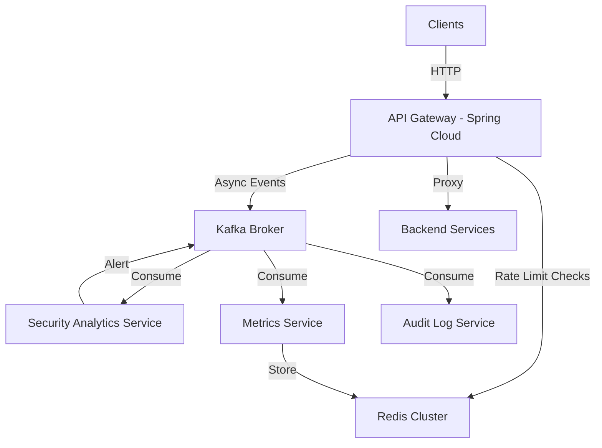

# Cloud Native API Gateway

A high-performance, stateless API Gateway built with Java 17, Spring Boot 3, and Spring Cloud Gateway. Includes distributed rate limiting (Redis), asynchronous event streaming (Kafka), and security analytics.

## Architecture




## Features

- **Distributed Rate Limiting**: Sliding window algorithm using Redis Lua scripts. atomic and low-latency.
- **Event-Driven Observability**: Every request is emitted to Kafka (`api-requests` topic).
- **Stateless Auth**: JWT and API Key validation.
- **Scalable Consumers**: Separate microservices for analytics and logging.
- **Resilience**: Fail-safe mechanisms for Redis downtime.

## Prerequisites

- Docker & Docker Compose
- Java 17

## Getting Started

1. **Start Infrastructure**:
   ```bash
   docker-compose up -d
   ```
   This starts Redis, Kafka (3 brokers), Zookeeper, Prometheus, and Grafana.

2. **Build & Run Services**:
   Since this is a multi-project setup, run them individually or use a script.
   ```bash
   # Terminal 1: Gateway
   cd api-gateway && ./mvnw spring-boot:run
   
   # Terminal 2: Backend
   cd backend-service && ./mvnw spring-boot:run
   
   # Terminal 3: Analytics
   cd security-analytics && ./mvnw spring-boot:run
   
   # Terminal 4: Metrics
   cd metrics-service && ./mvnw spring-boot:run
   ```

3. **Verify**:
   ```bash
   curl -i http://localhost:8080/api/v1/resource
   ```

4. **Load Testing**:
   Install k6 and run:
   ```bash
   k6 run testing/load-test.js
   ```

## Configuration

- **Rate Limits**: Configured in `RedisRateLimiter.java` (Default: 100 req/min per IP).
- **Kafka Topics**: `api-requests`, `api-blocked`, `security-alerts`.

## Observability

- **Prometheus**: http://localhost:9090
- **Grafana**: http://localhost:3000 (Creds: admin/admin)

## Directory Structure

- `api-gateway/`: Core gateway logic.
- `backend-service/`: Mock target service.
- `security-analytics/`: Anomaly detection consumer.
- `metrics-service/`: Traffic aggregation consumer.
- `audit-service/`: Audit logging consumer.
- `infra/`: Infrastructure configs.
