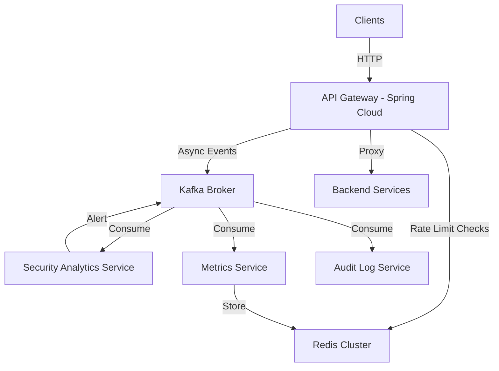

# Cloud Native API Gateway

A high-performance, stateless API Gateway built with Java 17, Spring Boot 3, and Spring Cloud Gateway. Includes distributed rate limiting (Redis), asynchronous event streaming (Kafka), and security analytics.

## Architecture



## Features

- **Distributed Rate Limiting**: Sliding window algorithm using Redis Lua scripts. Atomic and low-latency.
- **Event-Driven Observability**: Every request is emitted to Kafka (`api-requests` topic).
- **Stateless Auth**: JWT and API Key validation.
- **Scalable Consumers**: Separate microservices for analytics and logging.
- **Resilience**: Fail-safe mechanisms for Redis downtime.

## How Blocking Works

We implement a **Fail-Fast** blocking mechanism in the `RateLimitFilter`:

1.  **Request Arrival**: Every request is intercepted before routing.
2.  **Redis Check**: We execute an atomic Lua script on Redis to check rate limits for:
    -   **IP Address**
    -   **User ID** (if authenticated)
    -   **API Key** (if present)
3.  **Decision**:
    -   If **Allowed**: The request continues to the backend.
    -   If **Blocked**:
        -   Returns `429 Too Many Requests` immediately.
        -   Publishes a `BLOCKED` event to Kafka (`api-blocked` topic).
        -   The backend is never contacted.

## Prerequisites

- Docker & Docker Compose
- Java 17

## Getting Started

1. **Start Infrastructure**:
   ```bash
   docker-compose up -d
   ```
   This starts Redis, Kafka (3 brokers), Zookeeper, Prometheus, and Grafana.

2. **Build & Run Services**:
   Since this is a multi-project setup, run them individually:
   ```bash
   # Terminal 1: Gateway (Port 8033)
   cd api-gateway && ./mvnw spring-boot:run
   
   # Terminal 2: Backend (Port 8034)
   cd backend-service && ./mvnw spring-boot:run
   
   # Terminal 3: Analytics
   cd security-analytics && ./mvnw spring-boot:run
   
   # Terminal 4: Metrics (If applicable)
   cd metrics-service && ./mvnw spring-boot:run
   ```

3. **Verify**:
   ```bash
   curl -i http://localhost:8033/api/v1/resource
   ```

4. **Load Testing**:
   Install k6 and run:
   ```bash
   k6 run testing/load-test.js
   ```

## Configuration

- **Rate Limits**: Configured in `RedisRateLimiter.java` (Default: 100 req/min per IP).
- **Kafka Topics**: `api-requests`, `api-blocked`, `security-alerts`.

## Observability

- **Prometheus**: http://localhost:9090
- **Grafana**: http://localhost:3000 (Creds: admin/admin)

## Directory Structure

- `api-gateway/`: Core gateway logic (Spring Cloud Gateway).
- `backend-service/`: Mock target service using Spring Boot.
- `security-analytics/`: Anomaly detection consumer.
- `metrics-service/`: Traffic aggregation consumer.
- `audit-service/`: Audit logging consumer.
- `infra/`: Infrastructure configs (Helm, Docker).
- `testing/`: K6 load testing scripts and guides.
